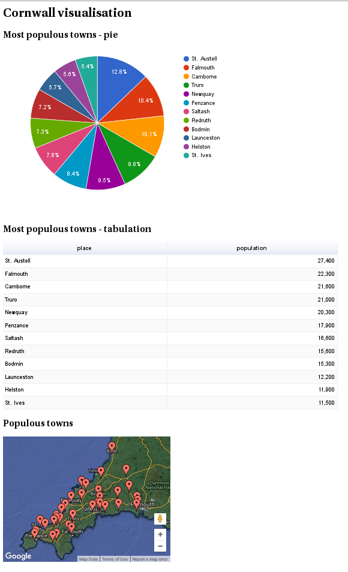
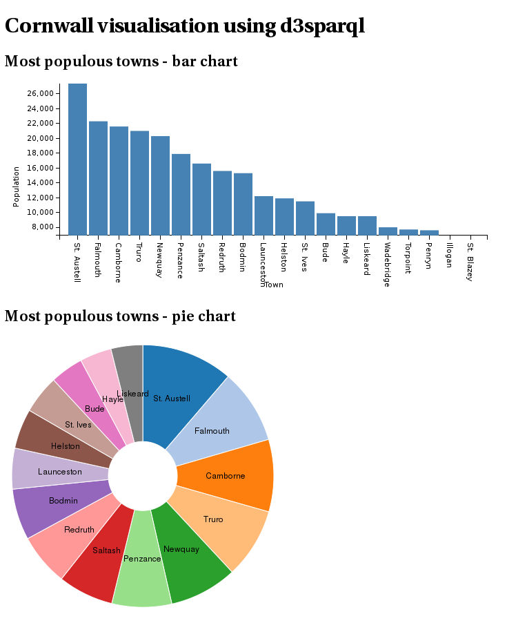

# Getting tooled up to use Gaffer

This page describes a set of alpha-quality tools I'm playing with to get working
with the Gaffer graph database.  My interest is linked data / RDF, and using
linked data visualisation.

## Compiling Gaffer

This is covered in
[Gaffer's Getting Started Guide](https://github.com/GovernmentCommunicationsHeadquarters/Gaffer/wiki/Getting-Started).  But basically, download the source,
check out the `develop` branch and run:

```
mvn clean package install
```
I have this working with git revision
`35010869cae9a246e064a2be2fd568b7a32d06b9`

## The REST interface

### Starting the REST interface

Gaffer has a REST interface which can be integrated with your
favourite web server, but for experimenting the stand-alone web service
can be easily started from the command line.

To use it, you need to feed it my data schema.  So, you need to copy
`dataSchema.json` and `dataTypes.json` from my source directory
`gaffer-schema` into your `gaffer` source directory at
`example-rest/src/main/resources/schema`.

Then in the Gaffer source tree, go into the `example-rest` directory and
run:

```
mvn install -P standalone
```

Some compiling occurs, and then the REST API starts on port 8080.

### Testing the REST interface

There are three Python scripts which test the REST API is working:

* `python addelements.py`.  It adds some elements to the graph.  It produces no output.
* `python dooperations.py` runs a key range query.  Output should be this:
   
   ```
   [{"class":"gaffer.data.element.Edge","properties":{"name":{"gaffer.function.simple.types.FreqMap":{"r:u:http://ex.org/#eats":4,"@r":4}}},"group":"BasicEdge","source":"n:u:http://ex.org/#lion","destination":"n:u:http://ex.org/#zebra","directed":true}]
   ```

* `python getrelatededges.py` runs a related edge query.  Output should look like this:
   ```
   [{"class":"gaffer.data.element.Edge","properties":{"name":{"gaffer.function.simple.types.FreqMap":{"r:u:http://ex.org/#eats":4,"@r":4}}},"group":"BasicEdge","source":"n:u:http://ex.org/#lion","destination":"n:u:http://ex.org/#zebra","directed":true}]
   ```

The Gaffer code is Java code.  You know if there's a problem, because you get a massive stack trace.

## Redland, RDF and SPARQL

### Install Redland

[Redland](http://librdf.org) is a set of APIs and utilities which support storage of RDF.  You'll need to install Redland and the development libraries, plus dependencies (curl, json-c, sqlite).

On Fedora, you need to install at least this set of packages:
* `redland`
* `redland-devel`
* `raptor2`
* `raptor2-devel`
* `rasqal`
* `rasqal-devel`
* `librdf`
* `librdf-devel`
* `python-librdf`
* `curl-devel`
* `json-c-devel`
* `sqlite-devel`
* `gcc-c`
* `gcc-c++`

### Compiling the code

This is in the `redland` directory.   Once Redland is installed, you should be able to compile the code by typing:
```
make
```
from the `redland` directory.

This compiles a set of things:
* A Redland store for Gaffer, `librdf_storage_gaffer.so`.  This needs to be installed in the Redland storage module directory, which on my box is `/usr/share/redland`.
* An executable, `test-sqlite` which performs a set of RDF operations against an SQLite store `STORE.DB`.
* An executable, `test-gaffer` which performs the same set of RDF operations
against a Gaffer database.

Before doing anything complicated, your first step is to check that the SQLite
code works:
```
./test-sqlite
```
You see a bunch of output, of which the last line is:
```
** Remove statements
```

If that works, the next step is to install the Gaffer storage module.  On my machine, the Redland storage modules are in `/usr/lib64/redland`.  If that's a directory on your machine, you can just run `make install` to install the module to that directory.

If that works, Redland now knows about accessing Gaffer through the REST API.  Try:
```
./test-gaffer
```
to see if you get the same output.

### Playing with Redland

If you got this far without errors, you have a Gaffer store running, with a few edges in it.  Redland has a set of command line tools you can use.  For instance:

You can dump out the edges:
```
rdfproc -s gaffer http://localhost:8080/example-rest/v1 print
```
And run a SPARQL query:
```
rdfproc -s gaffer http://localhost:8080/example-rest/v1 query sparql - 'SELECT ?a ?b ?c WHERE { ?a ?b ?c . }'
```

A more complex query:
```
rdfproc -s gaffer http://localhost:8080/example-rest/v1 query sparql - \
   'SELECT ?a
    WHERE {
      <http://gaffer.test/number#3> <http://gaffer.test/number#is_before> ?b .
      ?b <http://gaffer.test/number#is_before> ?a .
    }'
```

### Redland Python API

Redland has a set of language bindings, [including the Python binding](http://librdf.org/docs/pydoc/RDF.html).  This is contained in the Fedora `python-librdf` package.

```python

# Load RDF module
import RDF

# Add a statement
node1=RDF.Node(uri_string="http://ex.org/#lion")
node2=RDF.Node(uri_string="http://ex.org/#name")
node3=RDF.Node(literal="Lion")
statement=RDF.Statement(node1, node2, node3)

storage=RDF.Storage(storage_name="gaffer",
	name="http://localhost:8080/example-rest/v1",
        options_string="")
model=RDF.Model(storage)

model.add_statement(statement)

# Match on partial statement
statement=RDF.Statement(node1, None, None)
statements = model.find_statements(statement)
for v in statements:
    print v

# Run a SPARQL query
query = RDF.SPARQLQuery("SELECT ?b ?c WHERE { <http://ex.org/#lion> ?b ?c . }")
results = model.execute(query)
print results
```

## SPARQL endpoint

SPARQL defines a protocol which can be used to execute SPARQL queries
remotely.  An implementation of the SPARQL protocol is called a SPARQL
endpoint.

This is interesting for us, because a number of products
know how to use a SPARQL endpoint and would be easy to integrate.

The source code tree contains not ONE, but TWO SPARQL endpoint services.

These are fairly simple - they rely on Redland to do the SPARQL querying,
so they are just a lightweight HTTP wrapper on Redland.

### The Python service

Now we have RDF in Python, a bit of Python easily provides the SPARQL
endpoint.  Look in the `sparql` directory, and run:

```
./sparql_service
```

This runs a SPARQL service on `http://localhost:8081/sparql`.  The Python
implementation seems to be unreliable, and will segfault after a period of
time for a reason I can't work out.

### The C++ version

Also in the `sparql` directory, run `make` to build.  Uses `libmicrohttpd`
as the web server, so you should install a package called `libmicrohttp-devel`.

Run it:
```
./sparql 8081
```
and you have a SPARQL endpoint on port 8081.  I'll probably bin the Python
version once I'm happy the C++ is good enough.

### Interacting with the SPARQL endpoint

Redland's `roqet` utility knows how to query SPARQL. Example usage:
```
roqet -p http://localhost:8081/sparql -e 'SELECT ?a ?b ?c WHERE { ?a ?b ?c . }'
```

## Loading some real data

In the gaffer-tools source is a data set I created from data on Wikipedia
and Cornwall County Council site: `cornwall.ttl`.  It's in turtle format.

Before loading it into Gaffer, now would be a good time to clear out the
database, the easiest way to do that is to stop and start the Gaffer
REST API.  Ctrl-C, and restart:

Now, to load the Cornwall data set...
```
# Load the data
rdfproc -s gaffer http://localhost:8080/example-rest/v1 parse cornwall.ttl \
	turtle
```
Dump the data set to check it's there...
```
rdfproc -s gaffer http://localhost:8080/example-rest/v1 print
```
And run a SPARQL query for the fun of it...
```
roqet -p http://localhost:8081/sparql -e '
  SELECT ?b ?c
  WHERE { <https://github.com/cybermaggedon/cornwall/Fowey> ?b ?c . }'
```

## Visualising the data

### LodLive

With a SPARQL endpoint running, one easy way to get started with the data
is to run the excellent LodLive visualisation tool.  I've bundled a copy
of LodLive in the gaffer-tools source configured to work with the SPARQL
endpoint you have running.  To use, just point your browser at open one of the
`app*.html` files in the `lodlive` directory. e.g. `app_en.html`.

In Firefox, you press Ctrl-O to get the Open File dialogue, then just navigate
to the directory and open the file.

You get a screen with two rows of boxes.  The box at the bottom labelled
gaffer.test is where you go next.

The RESOURCE box is a drop-down.  You can select one of the examples, or search.
To search, select find resources.  From the CHOOSE A CLASS drop-down select
`gaffer.test/#town`.  Put `Fowey` in as a keyword, and press search.
If it all works, `http://gaffer.test/cornwall/#fowey` appears in the final box.
Press `start` to go visualising.  You see a big circle with "Fowey" in it
representing the Fowey resource.  To navigate press the small circles at
the edge of the bigger circles.  See what you can find!

The dataset includes geo information and links to photos on wikipedia, which
lodlive lets you see.  Where you see small "s" circles on the screen, these
are `sameAs` relationships which allow you to navigate between the same
entity The dataset I have includes `sameAs` links to `dbpedia.org`
resources, so you can you navigate into all sorts of interesting topics.
I'm sure you can work it out.  Might help you plan your next holiday :).


LodLive is open source, released under the MIT licence. 
LodLive development site is [here](http://en.lodlive.it/).

### Sgvizler

Another awesome tool is [Sgvizler](http://mgskjaeveland.github.io/sgvizler/).

Sgvizler integrates SPARQL and Google visualisations, allowing you to easily
query a SPARQL endpoint and invoke a Google visualisation on the resultant
data.

I've bundled a copy of Sgvizler, and a sample web page in the git repository.
To view, point your web-browser at sgvizler/cornwall.html in the source tree.
You should see a page like the shot below.



Sgvizler is open source, released under the MIT licence.

### d3sparql

Similar to Sgvizler is d3sparql, which feeds the results of a SPARQL query
to the D3 visualisation tool.

I've bundled a copy of d3sparql, and a sample web page in the git repository.
To view, point your web-browser at d3sparql/cornwall.html in the source tree.
You should see a page like the shot below.



Sgvizler is open source, released under the BSD licence.
