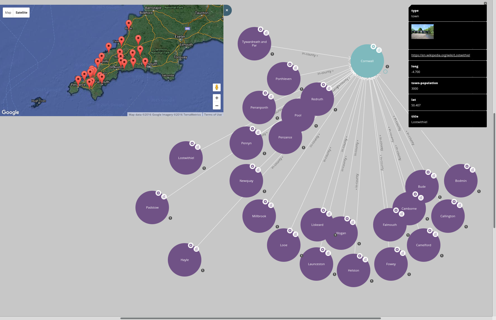

# Getting tooled up to use Gaffer

This page describes a set of alpha-quality tools I'm playing with to get working
with the Gaffer graph database.

## Compiling Gaffer

This is covered in
[Gaffer's Getting Started Guide](https://github.com/GovernmentCommunicationsHeadquarters/Gaffer/wiki/Getting-Started).  But basically, download the source,
check out the `develop` branch and run:

```
mvn clean package
```
I have this working with git revision `e65b146cf38026ebe66f48444ea716ba6b137fd3`.

## The REST interface

### Starting the REST interface

Gaffer's REST interface is mostly there, it just needs some packaging work, and
this is happening on a development branch.  In the interim I've got a simple
REST interface by embedding Gaffer into a Python web server using py4j.  This
implements a small subset of the REST API.  It uses Gaffer's JSON serialisers
and deserialisers, so should be interface-compatible with the REST API when
it is released.

This is not a production solution, and it won't perform or scale: The Python
aseHTTPServer class is single-threaded.

This is in the `rest-api` directory.  Components are:
* The `GafferEntryPoint` Java class instantiates the Gaffer store.  It is invoked through *py4j*.
* A Python wrapper which hosts the web-server and invokes Gaffer operations through the *py4j* interface.
* The `schema.json` configuration file defines the Gaffer schema.  It contains a configuration we'll use to store RDF later.
* The `store.properties` configuration file defines the Gaffer store.  This is configured to run a `MockAccumuloStore`, but changing this configuration would permit using a real Accumulo store.

To get this up and running:

1. First step is to assemble a `CLASSPATH` variable.  If it's any help, the 
   `env` file I've put in the directory will work for you.  If not, you're
   on your own.
   ```
   . ./env
   ```

2. Compile the `GafferEntryPoint` class:
   ```
   javac GafferEntryPoint.java
   ```

3. Run the `GafferEntryPoint` class:
   ```
   java GafferEntryPoint
   ```
   If it works, it doesn't return. This starts the Gaffer storage in that Java process.  You may get a warning about Hadoop NativeCodeLoader not working.  Seems safe to ignore this warning.

4. Run the Python service wrapper:
   ```
   ./service
   ```
   
   If both of those are running, you have a Gaffer with a REST API on port 8080.

### Testing the REST interface

There are three Python scripts which test the REST API is working:

* `python addelements.py`.  It adds some elements to the graph.  It produces no output.
* `python dooperations.py` runs a key range query.  Output should be this:
   
   ```
   [{"class":"gaffer.data.element.Edge","properties":{"name":{"gaffer.function.simple.types.FreqMap":{"r:u:http://ex.org/#eats":4,"@r":4}}},"group":"BasicEdge","source":"n:u:http://ex.org/#lion","destination":"n:u:http://ex.org/#zebra","directed":true}]
   ```

* `python getrelatededges.py` runs a related edge query.  Output should look like this:
   ```
   [{"class":"gaffer.data.element.Edge","properties":{"name":{"gaffer.function.simple.types.FreqMap":{"r:u:http://ex.org/#eats":4,"@r":4}}},"group":"BasicEdge","source":"n:u:http://ex.org/#lion","destination":"n:u:http://ex.org/#zebra","directed":true}]
   ```

The Gaffer code is Java code.  You know if there's a problem, because you get a massive stack trace.

## Redland, RDF and SPARQL

### Install Redland

[Redland](http://librdf.org) is a set of APIs and utilities which support storage of RDF.  You'll need to install Redland and the development libraries, plus dependencies (curl, json-c, sqlite).

On Fedora, you need to install at least this set of packages:
* `redland`
* `redland-devel`
* `raptor2`
* `raptor2-devel`
* `rasqal`
* `rasqal-devel`
* `librdf`
* `librdf-devel`
* `python-librdf`
* `curl-devel`
* `json-c-devel`
* `sqlite-devel`
* `gcc-c`
* `gcc-c++`

### Compiling the code

This is in the `redland` directory.   Once Redland is installed, you should be able to compile the code by typing:
```
make
```
from the `redland` directory.

This compiles a set of things:
* A Redland store for Gaffer, `librdf_storage_gaffer.so`.  This needs to be installed in the Redland storage module directory, which on my box is `/usr/share/redland`.
* An executable, `test-sqlite` which performs a set of RDF operations against an SQLite store `STORE.DB`.
* An executable, `test-gaffer` which performs the same set of RDF operations
against a Gaffer database.

Before doing anything complicated, your first step is to check that the SQLite
code works:
```
./test-sqlite
```
You see a bunch of output, of which the last line is:
```
** Remove statements
```

If that works, the next step is to install the Gaffer storage module.  On my machine, the Redland storage modules are in `/usr/lib64/redland`.  If that's a directory on your machine, you can just run `make install` to install the module to that directory.

If that works, Redland now knows about accessing Gaffer through the REST API.  Try:
```
./test-gaffer
```
to see if you get the same output.

### Playing with Redland

If you got this far without errors, you have a Gaffer store running, with a few edges in it.  Redland has a set of command line tools you can use.  For instance:

You can dump out the edges:
```
rdfproc -s gaffer http://localhost:8080/ print
```
And run a SPARQL query:
```
rdfproc -s gaffer http://localhost:8080/ query sparql - 'SELECT ?a ?b ?c WHERE { ?a ?b ?c . }'
```

A more complex query:
```
rdfproc -s gaffer http://localhost:8080/ query sparql - 'SELECT ?a WHERE { <http://gaffer.test/number#3>  <http://gaffer.test/number#is_before> ?b . ?b <http://gaffer.test/number#is_before> ?a . }'
```

### Redland Python API

Redland has a set of language bindings, [including the Python binding](http://librdf.org/docs/pydoc/RDF.html).  This is contained in the Fedora `python-librdf` package.

```python

# Load RDF module
import RDF

# Add a statement
node1=RDF.Node(uri_string="http://ex.org/#lion")
node2=RDF.Node(uri_string="http://ex.org/#name")
node3=RDF.Node(literal="Lion")
statement=RDF.Statement(node1, node2, node3)

storage=RDF.Storage(storage_name="gaffer", name="http://localhost:8080",
        options_string="")
model=RDF.Model(storage)

model.add_statement(statement)

# Match on partial statement
statement=RDF.Statement(node1, None, None)
statements = model.find_statements(statement)
for v in statements:
    print v

# Run a SPARQL query
query = RDF.SPARQLQuery("SELECT ?b ?c WHERE { <http://ex.org/#lion> ?b ?c . }")
results = model.execute(query)
print results
```

## SPARQL endpoint

### Running the service

SPARQL defines a protocol which can be used to execute SPARQL queries remotely.  This is interesting for us, because a number of products know how to use a SPARQL endpoint and would be easy to integrate.

Now we have RDF in Python, a bit of Python easily provides the SPARQL endpoint.  Look in the `sparql` directory, and run:
```
./sparql_service
```
This runs a SPARQL service on `http://localhost:8081/sparql`.

### Interacting with the SPARQL endpoint

Redland's `roqet` utility knows how to query SPARQL. Example usage:
```
roqet -p http://localhost:8081/sparql -e 'SELECT ?a ?b ?c WHERE { ?a ?b ?c . }'
```

## Loading some real data

In the gaffer-tools source is a data set I created from data on Wikipedia
and Cornwall County Council site: `cornwall.n`.

Before loading it into Gaffer, now would be a good time to clear out the
database, the easiest way to do that is to stop the GafferEntryPoint
process.  Ctrl-C, and restart:
```
java GafferEntryPoint
```
Now, to load the Cornwall data set...
```
# Convert n-triples to RDF/XML
rapper -o rdfxml -i ntriples cornwall.n > cornwall.rdf

# Load the data
rdfproc -s gaffer http://localhost:8080/ parse cornwall.rdf
```
Dump the data set to check it's there...
```
rdfproc -s gaffer http://localhost:8080/ print
```
And run a SPARQL query for the fun of it...
```
roqet -p http://localhost:8081/sparql -e '
  SELECT ?b ?c
  WHERE { <http://gaffer.test/cornwall/#Fowey> ?b ?c . }'
```

## Visualising the data

With a SPARQL endpoint running, one easy way to get started with the data
is to run the excellent LodLive visualisation tool.  I've bundled a copy
of LodLive in the gaffer-tools source configured to work with the SPARQL
endpoint you have running.  To use, just point your browser at open one of the
`app*.html` files in the `lodlive` directory. e.g. `app_en.html`.

In Firefox, you press Ctrl-O to get the Open File dialogue, then just navigate
to the directory and open the file.

You get a screen with two rows of boxes.  The box at the bottom labelled
gaffer.test is where you go next.

The RESOURCE box is a drop-down.  You can select one of the examples, or search.
To search, select find resources.  From the CHOOSE A CLASS drop-down select
`gaffer.test/#town`.  Put `Fowey` in as a keyword, and press search.
If it all works, `http://gaffer.test/cornwall/#fowey` appears in the final box.
Press `start` to go visualising.  You see a big circle with "Fowey" in it
representing the Fowey resource.  To navigate press the small circles at
the edge of the bigger circles.  See what you can find!

The dataset includes geo information and links to photos on wikipedia, which
lodlive lets you see.  Where you see small "s" circles on the screen, these
are `sameAs` relationships which allow you to navigate between the same
entity The dataset I have includes `sameAs` links to `dbpedia.org`
resources, so you can you navigate into all sorts of interesting topics.
I'm sure you can work it out.  Might help you plan your next holiday :).



